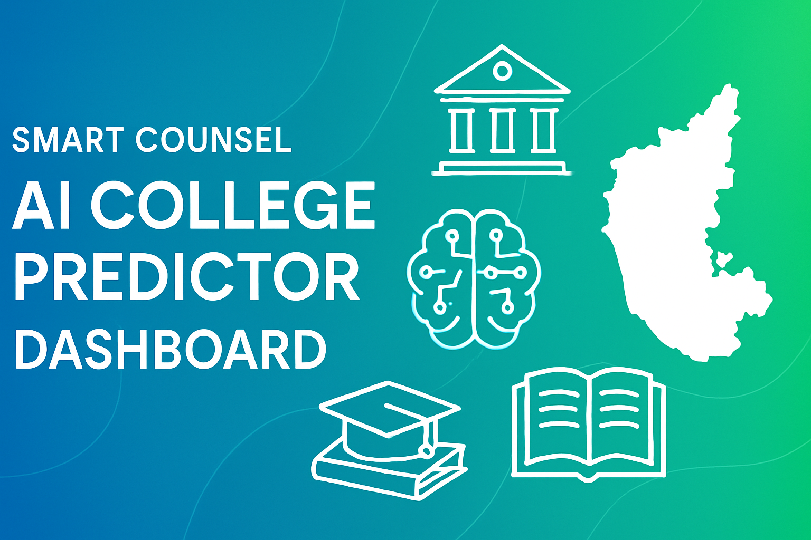

# 🎓✨ Smart Counsel AI ✨🤖  

<!-- Banner Image -->
<p align="center">
  
</p>

<!-- Badges -->
<p align="center">
  <!-- Tech Stack -->
  <a href="https://www.python.org/"></a>
  <a href="https://streamlit.io/"></a>
  <a href="https://huggingface.co/"></a>
  <a href="https://pytorch.org/"></a>
  <a href="https://github.com/facebookresearch/faiss"></a>
  <a href="https://www.oper.ai/"></a>
  <a href="https://openai.com/"></a>
  <a href="https://en.wikipedia.org/wiki/Retrieval-augmented_generation"></a>


## 🏫 About Smart Counsel AI 🎯  

Smart Counsel AI is your **all-in-one college prediction & exploration assistant** 🎓✨ for **KCET & COMEDK aspirants** in Karnataka 🇮🇳.  

It blends **RAG-powered Q&A 🔍**, **college predictor 📊**, **explorer 🧭**, and **mock option simulator 🎮** into one **seamless, responsive app** with animations 🎉.  

💡 **Goal:** Empower students with **data-driven insights** & a **smooth counseling experience** 🌈.  

---

## ⚡ Features 🔥  

- 🎓 **College Predictor** → Accurate, category-aware suggestions  
- 🏫 **Explorer** → Filter by branch, placements, fees, NIRF rank & more  
- 🤖 **LLM Q&A (Operai Mini)** → Ask complex questions in natural language  
- 🧑‍💻 **Option Entry Simulator** → Practice & master KCET/COMEDK option filling  
- 📊 **Visual Insights** → Beautiful cutoff trends, placement graphs, NIRF stats  
- ✨ **Modern UI** → Emoji-rich 🎉, Lottie animations 🎨, fully responsive 📱  

---

## 🛠️ Tech Stack 💻  

| 🚀 Layer | 🛠️ Tools |
|----------|-----------|
| 🌐 Web App | Streamlit, streamlit-lottie |
| 🔎 ML/Embedding | SentenceTransformers (MiniLM-L6-v2) |
| 🤖 LLM Answering | Operai Mini, HuggingFace Transformers |
| 📂 Vector DB | FAISS |
| ⚙️ Backend | Pandas, Numpy, Torch, Matplotlib, Pickle |

---

## 📂 Project Structure 🏗️  

Smart_Counsel_AI/
├── app.py # 🚀 Streamlit main launcher
├── pages/
│ ├── predictor.py # 🎓 College predictor
│ ├── explorer.py # 🏫 Explorer & filters
│ ├── faq.py # 🤖 LLM chatbot
│ └── simulator.py # 🎮 Option entry simulator
├── RAG_utils/
│ ├── rag_utils.py # 🔎 FAISS retrieval
│ └── llm_utils.py # 🤖 LLM generation
├── data/
│ ├── cutoff_data/ # 📊 KCET/COMEDK cutoffs
│ ├── colleges.csv # 🏫 College codes & names
│ ├── placements.csv # 💼 Placement info
│ ├── seat_matrix.csv # 🪑 Seat/category data
│ ├── fees.csv # 💰 Fees & scholarships
│ └── college_list.csv # 📋 College list
├── assets/
│ ├── animations/ # 🎨 Lottie animations
│ └── plots/ # 📈 Graphs
└── requirements.txt


---

## 🧠 How RAG Works 🔮  

1️⃣ **Embed Query** → Convert your question to vector using MiniLM-L6-v2  
2️⃣ **Retrieve Context** → FAISS fetches top-5 relevant chunks 📂  
3️⃣ **Generate Answer** → Operai Mini crafts an answer ✍️  
4️⃣ **Show Transparency** → Sources + detailed explanation 📝  

---

## 🚀 Installation & Run 🖥️  

```bash
# 1. Clone repo
git clone https://github.com/yourname/Smart_Counsel_AI.git
cd Smart_Counsel_AI

# 2. Install requirements
pip install -r requirements.txt

# 3. Run app 🚀
streamlit run app.py


🔗 Visit: http://localhost:8501

☁️ Deploy on Streamlit Cloud 🌐

📤 Push repo to GitHub

🚀 Deploy on Streamlit Cloud

⚙️ Configure requirements.txt + data files

🎉 Share live preview instantly!

📸 Screenshots 🖼️

👉 (Add screenshots like predictor UI, explorer, chatbot, graphs here!)

🔮 Future Enhancements 🌟

🧩 Explainability (SHAP) for predictions

📦 Batch rank predictions

🐳 Docker/CI pipelines

👤 User profiles & save option entries

📊 Richer analytics + 3D visualizations

📜 License ⚖️

MIT License – see LICENSE

💌 Contact & Feedback 📢

Made with ❤️ by Akash Anup Kumar ✨
💡 Contributions & suggestions welcome → PRs & Issues!

⭐ If you like this project, don’t forget to star ⭐ the repo! 🌟

